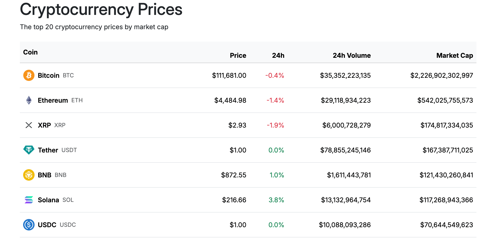
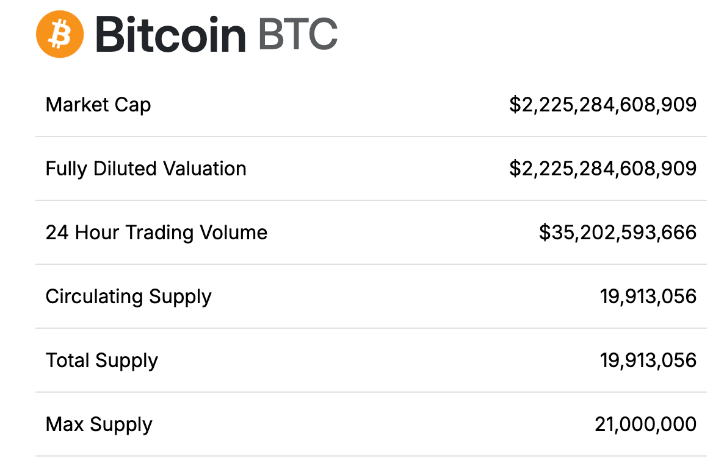
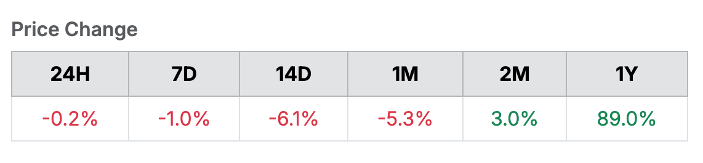

# Cryptocurrency Tracker

A Node.js + Express.js web app that fetches cryptocurrency data 
from the [CoinGecko API](https://www.coingecko.com/en/api) and 
displays the top 20 cryptocurrencies.

## Screenshots


 


## Features 

- View Top 20 Cryptocurrencies
- View Coin History
- Live Market Data

## Tech Stack

- **Backend:** Node.js, Express.js

- **Templating:** EJS

- **Frontend:** Bootstrap

- **API:** COinGecko API

## Note

This app uses the **CoinGecko API demo plan**. In order
to successfully run this project, an API key is required.
You can request a free demo API key at
[CoinGecko API](https://www.coingecko.com/en/api). Keep in mind 
the restrictions for the demo plan.

## Setup and Installation

1. Clone the repo:

    ```bash 
    git clone https://github.com/almshahnaz/cryptotracker.git
    cd crypto-tracker
    ```

2. Install dependencies:
    ```bash 
    npm install
    ```

3. Create a `.env` file:
    ```env
    PORT=3000
    API_KEY=your_api_key
    API_BASE_URL=api_base_url
    ```

4. Start the server:
    ```bash
    npm start
    ```

5. Open in your browser:
    ```bash
    http://localhost:3000
    ```

## License

This project is licensed under the [MIT](LICENSE.md) license.

